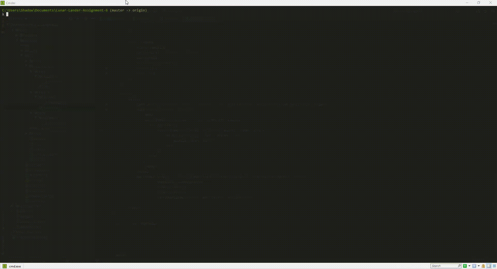

# Lunar-Lander-Assignment-6
Lunar lander application of the pipe-and-filter architecture style 
Fall 2019 SE 451 at CALIFORNIA STATE UNIVERSITY SAN MARCOS (CSUSM)

The purpose of the project was to see how the pipe and filter style is working. 

By default:
>  java GetBurnRate.java | java CalcNewValues.java | java DisplayValues.java

CalcNewValues is written in CPP
DisplayValues in Rust

